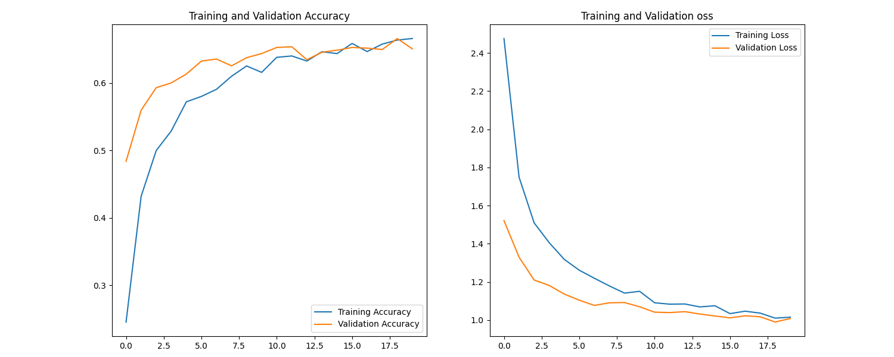

<!-- PROJECT LOGO -->
<br />
<p align="center">
  <a href="https://github.com/JohanHorsmans/cds-visual-exam-2021">
    
  </a>
  
  <h1 align="center">Cultural Data Science 2021</h1> 
  <h3 align="center">Assignment 5</h3> 

  <p align="center">
    Johan Kresten Horsmans
    <br />
    <a href="https://github.com/JohanHorsmans/cds-visual-exam-2021/blob/main/Visual_Analytics_Exam.pdf"><strong>Link to PDF with all portfolio descriptions »</strong></a>
    <br />
  </p>
</p>

<!-- TABLE OF CONTENTS -->
<details open="open">
  <summary>Table of Contents</summary>
  <ol>
    <li><a href="#offical-description-from-instructor">Offical description from instructor</a></li>
    <li><a href="#methods">Methods</a></li>
    <li><a href="#how-to-run">How to run</a></li>
    <li><a href="#repository-structure-and-contents">Repository structure and contents</a></li>
    <li><a href="#discussion-of-results">Discussion of results</a></li>
  </ol>
</details>

<!-- OFFICIAL DESCRIPTION FROM INSTRUCTOR -->
## Offical description from instructor

__Multi-class classification of impressionist painters__

So far in class, we've been working with 'toy' datasets - handwriting, cats, dogs, and so on. However, this course is on the application of computer vision and deep learning to cultural data. This week, your assignment is to use what you've learned so far to build a classifier which can predict artists from paintings.

You can find the data for the assignment here: https://www.kaggle.com/delayedkarma/impressionist-classifier-data

Using this data, you should build a deep learning model using convolutional neural networks which classify paintings by their respective artists. Why might we want to do this? Well, consider the scenario where we have found a new, never-before-seen painting which is claimed to be the artist Renoir. An accurate predictive model could be useful here for art historians and archivists!

For this assignment, you can use the CNN code we looked at in class, such as the ShallowNet architecture or LeNet. You are also welcome to build your own model, if you dare - I recommend against doing this.

Perhaps the most challenging aspect of this assignment will be to get all of the images into format that can be fed into the CNN model. All of the images are of different shapes and sizes, so the first task will be to resize the images to have them be a uniform (smaller) shape.

You'll also need to think about how to get the images into an array for the model and how to extract 'labels' from filenames for use in the classification report

__Tips__

* You should save visualizations showing loss/accuracy of the model during training; you should also a save the output from the classification report
* I suggest working in groups for this assignment. The data is quite large and will take some time to move over to worker02. Similarly training the models will be time consuming, so it is preferably to have fewer models on the go.
* You might want to consider a division of labour in your group. One person working on resizing images, one working on extracting labels, one developing the model, etc.
* For reshaping images, I suggest checking out cv.resize() with the cv2.INTER_AREA method
* If you have trouble doing this on your own machines, use worker02
* Don't worry if the results aren't great! This is a complex dataset we're working with

__General instructions__

* Save your script as cnn-artists.py
* If you have external dependencies, you must include a requirements.txt
* You can either upload the script here or push to GitHub and include a link - or both!
* Your code should be clearly documented in a way that allows others to easily follow along
* Similarly, remember to use descriptive variable names! A name like X_train is (just) more readable than x1

__Purpose__

This assignment is designed to test that you have a understanding of:

* how to build and train deep convolutional neural networks;
* how to preprocess and prepare image data for use in these models;
* how to work with complex, cultural image data, rather than toy datasets

<!-- METHODS -->
## Methods

The problem of the assignment relates to classifying complex image data that even most humans would have a hard time classifying correctly. To address the problem, I finetuned an advanced pretrained CNN in the form of the _MobileNetV2_ -model developed by Google AI. Besides finetuning parameters, I also expanded the MobileNetV2-model by adding three layers on top; an average pooling layer, a dropout layer (with 40% of the layer inputs set to 0) and, finally a classification layer. A large challenge in finetuning the model consists of preprocessing the images into a compatible format. To do this, I have taken inspiration from my self-assigned project, where I define a function that can easily convert any image into a format compatible with a CNN-architecture. I converted all the paintings to 224x224 images, since this is what the model was originally trained on. I used argparse to enable the user to specify the number of training epochs from the terminal. Note that my script uses the same data for validation and testing.

<!-- HOW TO RUN -->
## How to run

__NOTICE:__ To run the assignment, you need to have configured and activated your virtual environment. See the main [README](https://github.com/JohanHorsmans/cds-visual-exam-2021/blob/main/README.md) for a guide on how to do this.

Go through the following steps to run assignment 5:
```bash
cd {root directory (i.e. cds-visual-exam-2021}
cd assignment_5
python3 cnn-artists.py
```
Type: ```python3 cnn-artists.py -h``` for a detailed guide on how to specify script-parameters. 

<!-- REPOSITORY STRUCTURE AND CONTENTS -->
## Repository structure and contents

This repository contains the following files:
|File|Description|
|:--------|:-----------|
```cnn-artists.py``` | The python script for the assignment
```README.md``` | The README file that you are currently reading.

<!-- DISCUSSION OF RESULTS -->
## Discussion of results

Using the CNN, I achieve a macro F1-score of 0.65 after training for 20 epochs. For the reasoning behind using macro F1-score as my evaluation metric, see [Assignment 4 - Methods](https://github.com/JohanHorsmans/cds-visual-exam-2021/tree/main/assignment_4#methods). The training curves show that the accuracy and loss for the validation data (i.e. training data) flattens after approximately 10 epochs (see _figure 2_). As such, I argue that more epochs would most likely not result in a better macro F1-score. Even though the results might not seem impressive, I argue that it is a very convincing performance for such a complex task.

<br />
<p align="center">
  <a href="https://github.com/JohanHorsmans/cds-visual-exam-2021">
    
  </a>

<p align="center">
Figure 1: Training curves for the MobileNetV2-model in assignment 5.

  
<br />
<p align="center">
  <a href="https://github.com/JohanHorsmans/cds-visual-exam-2021">
    
  </a>


