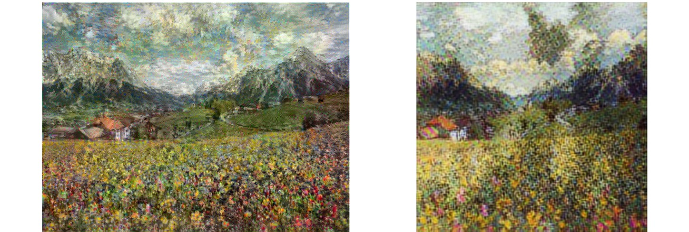

<!-- PROJECT LOGO -->
<br />
<p align="center">
  <a href="https://github.com/JohanHorsmans/cds-visual-exam-2021">
    
  </a>
  
  <h1 align="center">Cultural Data Science 2021</h1> 
  <h3 align="center"><ins>Self Assigned Project:</ins>

Creating and classifying fake art</h3> 

  <p align="center">
    Johan Kresten Horsmans
    <br />
    <a href="https://github.com/JohanHorsmans/cds-visual-exam-2021/blob/main/Visual_Analytics_Exam.pdf"><strong>Link to PDF with all portfolio descriptions »</strong></a>
    <br />
  </p>
</p>

<!-- TABLE OF CONTENTS -->
<details open="open">
  <summary>Table of Contents</summary>
  <ol>
    <li><a href="#project-description">Project description</a></li>
    <li><a href="#methods">Methods</a></li>
    <li><a href="#how-to-run">How to run</a></li>
    <li><a href="#repository-structure-and-contents">Repository structure and contents</a></li>
    <li><a href="#discussion-of-results">Discussion of results</a></li>
  </ol>
</details>

<!-- PROJECT DESCRIPTION -->
## Project description

__Creating fake Monet-images with style transfer and classifying them with CNN's:__

For my self-assigned project, I wish to see if I can use style-transferring to create fake Monet-paintings out of landscape pictures. Furthermore, I want to test if these images are believable enough to trick a CNN-image classifier into classifying them as real Monet-paintings. I have decided to turn in my project as a Jupyter Notebook, since there is a great emphasis on visualizations throughout. Furthermore, the code is not intended to be used for other purposes. Therefore, I deemed it to be the most beneficial format for my project. As such, it is a deliberate choice that I have not converted it to as a .py-script and not a case of lacking abilities.

The notebook consists of the following steps (in rough terms):

1. Creating fake Monet-images out of landscape images using style transfer.
    - The dataset used for the Monet-images (i.e. style-images) is the following: [_Impressionist Classifier Data_](https://www.kaggle.com/delayedkarma/impressionist-classifier-data). I have manually removed the image titled _"9223372032559844173.jpg"_, since it was corrupt.
    - The dataset used for landscape-images (i.e. content-images) is the following: [_Landscape picture_](https://www.kaggle.com/arnaud58/landscape-pictures)
2. Saving the fake images.
3. Splitting the data into a testing- and training dataset (containing real- and fake images).
4. Preprocessing the images into a consistent format compatible with a CNN classifier.
5. Building and training a CNN-classifier from scratch.
6. Classifying testing data with the CNN-classifier.
7. Fine-tuning a pretrained _MobileNetV2_ model.
8. Using the fine-tuned model to classify testing data.

<!-- METHODS -->
## Methods
The task is a two-part problem. First, one needs to create a model for carrying out the style transfer and second, one needs to build a classifier capable of distinguishing between the real- and "fake" images. To address the first problem, I initially experimented with using a [_VGG19_](https://www.tensorflow.org/tutorials/generative/style_transfer)-model, but it took approximately 1.5 hour per style-transferred image, rendering the task practically undoable. Instead, I used the [_magenta/arbitrary-image-stylization-v1-256 model_](https://tfhub.dev/google/magenta/arbitrary-image-stylization-v1-256/2)-model from tensorflow hub. This model was a lot more efficient and produced mostly convincing results that I deemed to be only moderately worse compared to the VGG19-model (see comparison in _figure 3_). Both models took only a single content- and style image per style transfer. For the classification task, I first developed a CNN from scratch. This generated mediocre results so I wanted to see if I could find a better and more efficient classifier. To do so I utilized the pretrained [_MobileNetV2_](https://ai.googleblog.com/2018/04/mobilenetv2-next-generation-of-on.html)-model. Both CNN-models and their predictions are included in the notebook. Note that my notebook uses the same data for validation and testing.

<br />
<p align="center">
  <a href="https://github.com/JohanHorsmans/cds-visual-exam-2021">
    
  </a>
 
<p align="center">
Figure 3: Comparison of the style-transferred output produced by the VGG19-model (left) and the arbitrary-image-stylization-v1-256-model (right).
  
<!-- HOW TO RUN -->
## How to run

__NOTICE:__ To run the assignment, you need to download the data and have configured and activated your virtual environment. See the main [README](https://github.com/JohanHorsmans/cds-visual-exam-2021/blob/main/README.md) for a guide on how to do this.

Go through the following steps to run the assignment:
1. Navigate to the "self_assigned"-folder.
2. Open the "self_assigned.ipynb"-file.
3. Make sure the kernel is set to visual_venv.
    - You can do this by pressing "kernel" -> "change kernel" -> "visual_venv". 

<!-- REPOSITORY STRUCTURE AND CONTENTS -->
## Repository structure and contents

This repository contains the following folder (before downloading data):
|File|Description|
|:--------|:-----------|
[```raw_data/```](https://github.com/JohanHorsmans/cds-visual-exam-2021/tree/main/self_assigned/raw_data) | A folder with all the 398 Monet images and 25 handpicked content-images depicting French landscapes. 

Furthermore, it also contains the following files:
|File|Description|
|:--------|:-----------|
```self-assigned-project.ipynb``` | The jupyter notebook for the assignment
```README.md``` | The README file that you are currently reading.


<!-- DISCUSSION OF RESULTS -->
## Discussion of results
The "homemade" CNN-model (henceforth referred to as model 1) yielded a macro F1-score of 0.64 after training for 50 epochs. By comparison the pretrained MobileNetV2-model achieved a macro F1-score of 0.99 after only 10 epochs of training. As such, it greatly outperforms the initial model on both performance and efficiency. The training- loss and accuracy for model 1 (see figure 4), does not seem to flatten, suggesting that more training epochs could potentially improve results. For model 1 the accuracy for the validation data (i.e. testing data) is initially higher than the accuracy for the training data. I argue that this is most likely due to the dropout-layer at the end of the model since, when training, 60% of the dropout input nodes are set to 0 whereas, in testing, all nodes are active and utilized. It seems plausible that this testing-data advantage could be the reason behind the more robust classification of the testing data in the early stages of training. For the MobileNetV2-model, the accuracy for the testing data is higher than the accuracy for the training data for all epochs (see figure 5). I argue that this is also most likely due to the dropout-layer added to the model. I tried both removing the dropout-layer and making it less conservative. For both models, this resulted in a performance decrease.

<br />
<p align="center">
  <a href="https://github.com/JohanHorsmans/cds-visual-exam-2021">
    
  </a>

<p align="center">
Figure 4: Training curves for model1 in the self-assigned project

<br />
<p align="center">
  <a href="https://github.com/JohanHorsmans/cds-visual-exam-2021">
    
  </a>

<p align="center">
Figure 5: Training curves for the MobileNetV2-model in the self-assigned project

<br />
<p align="center">
  <a href="https://github.com/JohanHorsmans/cds-visual-exam-2021">
    
  </a>


