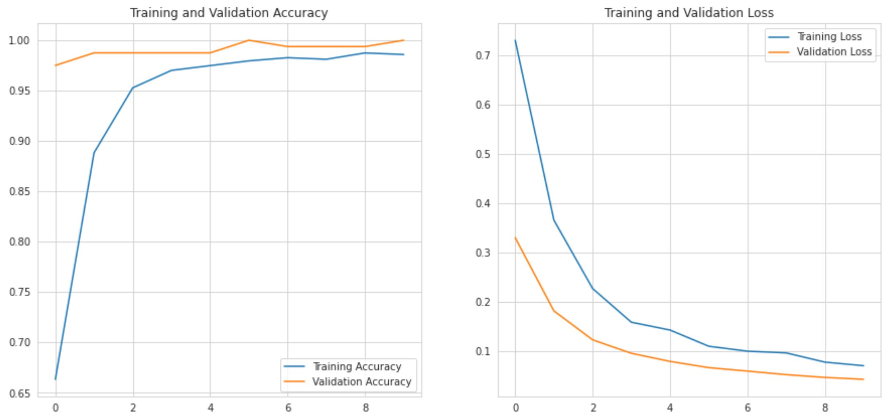

<!-- PROJECT LOGO -->
<br />
<p align="center">
  <a href="https://github.com/JohanHorsmans/cds-visual-exam-2021">
    
  </a>
  
  <h1 align="center">Cultural Data Science 2021</h1> 
  <h3 align="center"><ins>Self Assigned Project:</ins>

Creating and classifying fake art</h3> 

  <p align="center">
    Johan Kresten Horsmans
    <br />
    <a href="https://github.com/JohanHorsmans/cds-visual-exam-2021.pdf"><strong>Link to portfolio descriptions »</strong></a>
    <br />
  </p>
</p>

<!-- TABLE OF CONTENTS -->
<details open="open">
  <summary>Table of Contents</summary>
  <ol>
    <li><a href="#project-description">Project description</a></li>
    <li><a href="#methods">Methods</a></li>
    <li><a href="#how-to-run">How to run</a></li>
    <li><a href="#repository-structure-and-contents">Repository structure and contents</a></li>
    <li><a href="#data">Data</a></li>
  </ol>
</details>

<!-- PROJECT DESCRIPTION -->
## Project description

__Creating fake Monet-images with style transfer and classifying them with CNN's__

For my self-assigned project, I have created a notebook with a pipeline consisting of the following steps:

1. Creating fake Monet-images out of landscape images using style transfer.
    - The dataset used for the Monet-images (i.e. style-images) is the following: https://www.kaggle.com/delayedkarma/impressionist-classifier-data
    - The dataset used for landscape-images (i.e. content-images) is the following: https://www.kaggle.com/arnaud58/landscape-pictures
2. Saving the fake images.
3. Splitting the data into a testing- and training dataset (containing real- and fake images).
4. Preprocessing the images into a consistent format compatible with a CNN classifier.
5. Building a CNN-classifier from scratch.
6. Classifying testing data with the CNN-classifier.
7. Fine-tuning a pretrained _MobileNetV2_ model.
8. Using the fine-tuned model to classify testing data.

<!-- METHODS -->
## Methods

The task is a two-part problem. First, one needs to create a model for carrying out the style transfer and second, one needs to build a classifier capable of distinguishing between the real- and "fake" images. To address the first problem, I first used the [_magenta/arbitrary-image-stylization-v1-256 model_](https://tfhub.dev/google/magenta/arbitrary-image-stylization-v1-256/2) from tensorflow hub. For the second task I first developed a CNN from scratch. This generated mediocre results so I wanted to see if I could find a better and more efficient classifier. To do so I utilized the pretrained [_MobileNetV2_](https://ai.googleblog.com/2018/04/mobilenetv2-next-generation-of-on.html) model. 

<!-- HOW TO RUN -->
## How to run

__NOTICE:__ To run the assignment, you need to download the data and have configured and activated your virtual environment. See the main [README](https://github.com/JohanHorsmans/cds-visual-exam-2021/blob/main/README.md) for a guide on how to do this.

Go through the following steps to run the assignment:
1. Navigate to the "self_assigned"-folder.
2. Open the "self_assigned.ipynb"-file.
3. Make sure the kernel is set to visual_venv.
    - You can this by pressing "kernel" -> "change kernel" -> "visual_venv". 

<!-- Discussion of results -->
## Discussion of results
The "homemade" CNN-model (henceforth referred to as model 1) yielded a macro F1-score of 0.59 after training for 50 epochs. By comparison the pretrained MobileNetV2-model achieved a macro F1-score of 0.99 after only 10 epochs of training. As such, it greatly outperforms the initial model on both performance and efficiency. The training- loss and accuracy for model 1 (see figure 1), seems to suggest that more training epochs could potentially improve results. For both models the accuracy for the validation (i.e. testing data) is much higher in the early epochs compared to the later ones (see figure 1 and 2). I argue that this is most likely due to the ```dropout``` layer at the end of both models, since, when training, 60% of the features are set to 0, whereas, in testing, all features are active and utilized. It seems plausible that this would be the reason behind the more robust classification for testing data in the early stages of model training.

__FIGURE 1__
<br />
<p align="center">
  <a href="https://github.com/JohanHorsmans/cds-visual-exam-2021">
    
  </a>
  
__FIGURE 2__
<br />
<p align="center">
  <a href="https://github.com/JohanHorsmans/cds-visual-exam-2021">
    
  </a>
  

<!-- REPOSITORY STRUCTURE AND CONTENTS -->
## Repository structure and contents

This repository contains the following files:
|File|Description|
|:--------|:-----------|
```cnn-artists.py``` | The python script for the assignment
```README.md``` | The README file that you are currently reading.

<!-- DATA -->
## Data

This repository contains the following files:
|File|Description|
|:--------|:-----------|
```cnn-artists.py``` | The python script for the assignment
```README.md``` | The README file that you are currently reading.

<br />
<p align="center">
  <a href="https://github.com/JohanHorsmans/cds-visual-exam-2021">
    
  </a>


